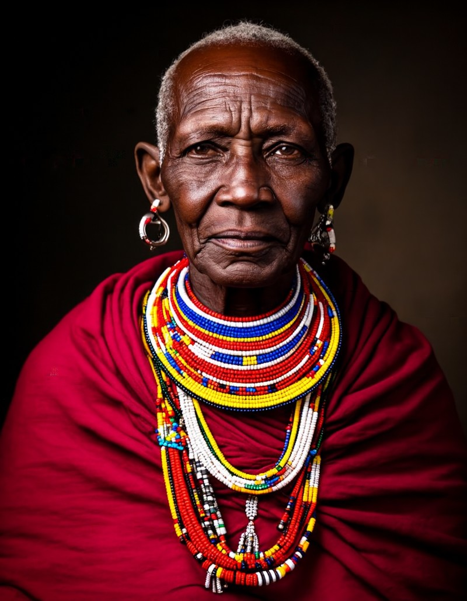
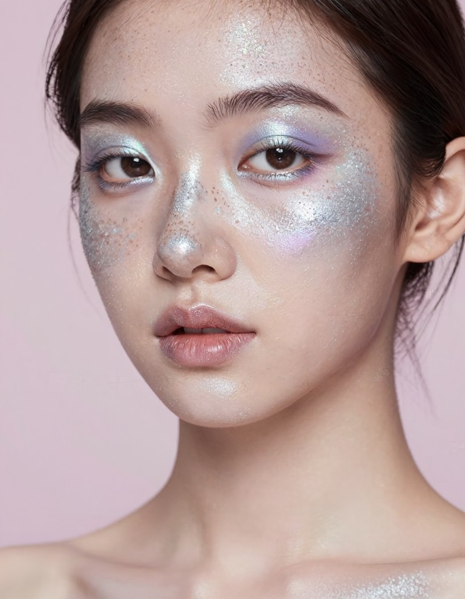
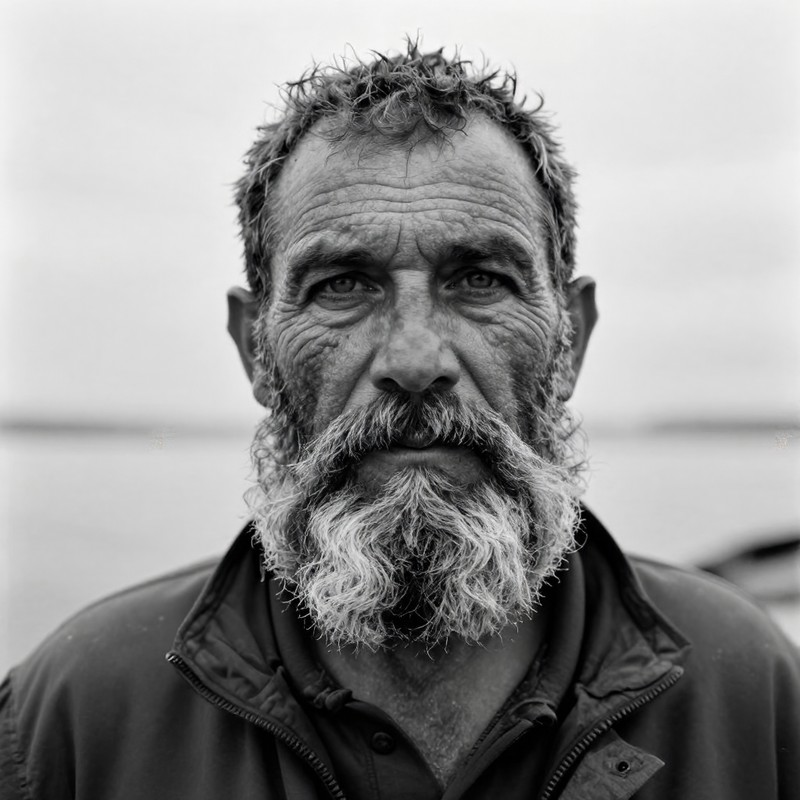
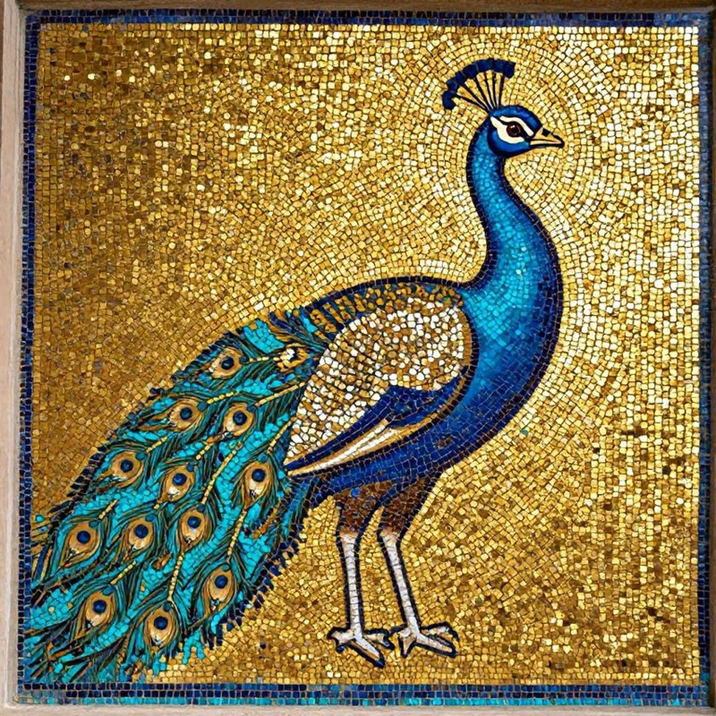
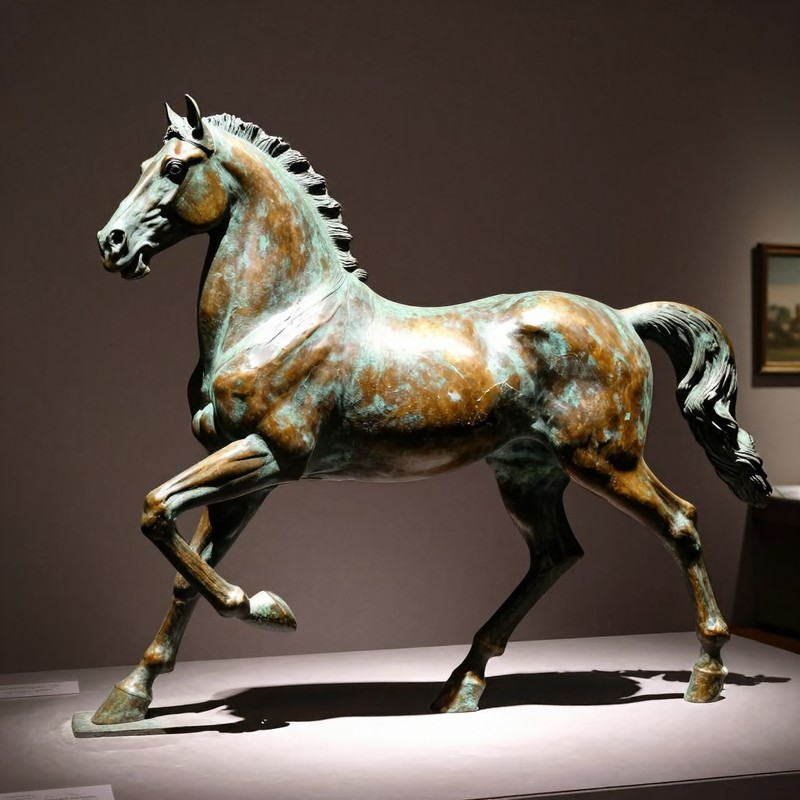
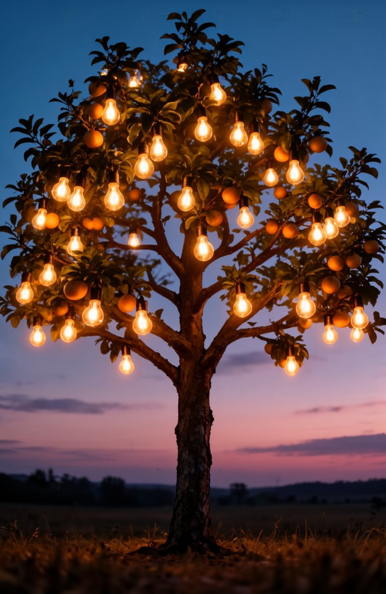
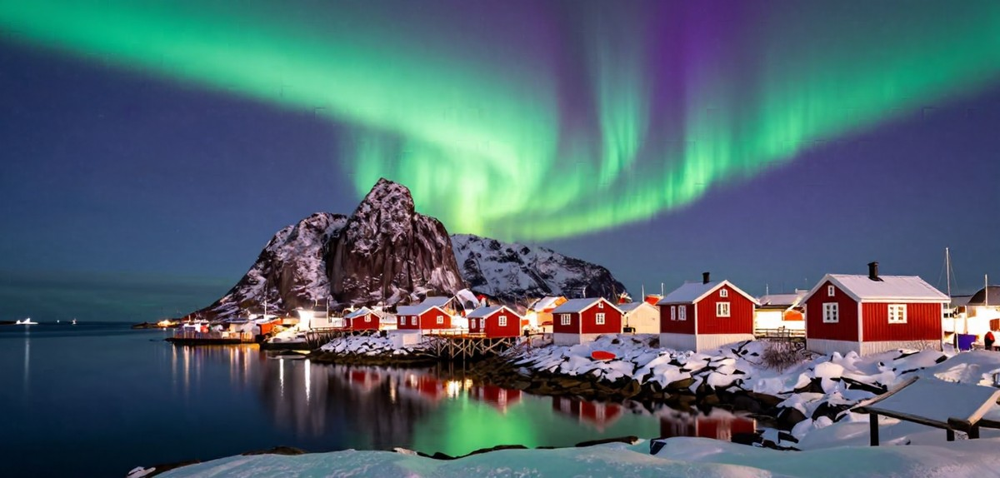
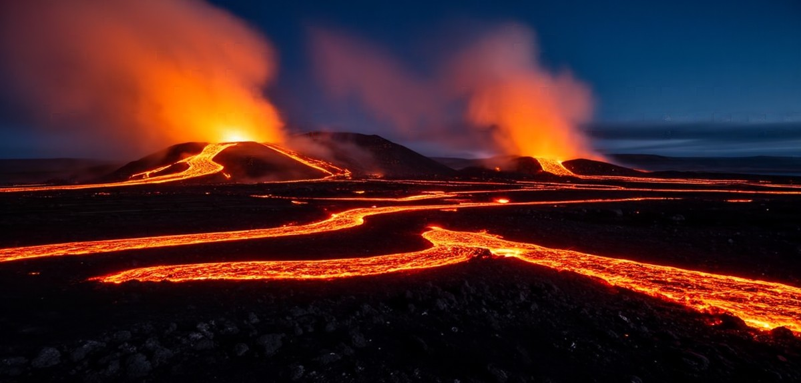
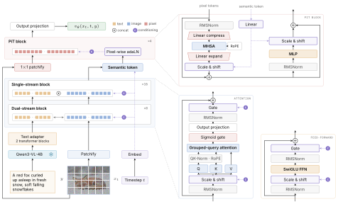

# Iris-3B

**Going Beyond the Latent with Pixel-Space Diffusion Training, Conversion and Fine-Tuning**

Generative priors are a promising foundation for downstream vision tasks. In
this project we explore pixel-space generative models as an alternative to
vision foundation models such as DINOv2.

Iris-3B is a 3B-parameter text-to-image diffusion transformer that generates
directly in pixel space: no VAE, every pixel is produced by the model. This
repository contains the model, the training code used to train it, and
inference.

<div align="center">

[](https://speridlabs.com/research/iris)
[](https://huggingface.co/speridlabs/iris-3b)
[](https://huggingface.co/spaces/speridlabs/iris-3b)
[](LICENSE)
[](https://www.python.org/downloads/)

</div>

https://github.com/user-attachments/assets/2345a853-c673-4ddb-83b9-7e05c83198ed

## Generations

Samples from the final checkpoint at native aspect ratios of about one megapixel
(CFG 3, 100 steps, one fixed seed, no prompt rewriting).

<table>
<tr>
<td width="33%" valign="top"><br><sub>Studio portrait of a Maasai elder wearing vibrant beaded jewelry, deep red cloth, dark backdrop, Rembrandt lighting, ultra detailed skin texture</sub></td>
<td width="33%" valign="top"><br><sub>Close-up portrait of a young woman with silver glitter freckles and iridescent makeup, soft pastel background, high fashion beauty photography</sub></td>
<td width="33%" valign="top"><br><sub>A glass sculpture of a heart filled with flowers, caustics and reflections, 3D render</sub></td>
</tr>
</table>

<table>
<tr>
<td width="33%" valign="top"><br><sub>Black and white portrait of a fisherman with a thick grey beard and deep wrinkles, piercing eyes, overcast light, fine grain film photograph</sub></td>
<td width="33%" valign="top"><br><sub>A Byzantine-style mosaic of a peacock made of tiny gold and turquoise tiles, shimmering texture</sub></td>
<td width="33%" valign="top"><br><sub>A bronze sculpture of a horse in motion, patina, dramatic museum spotlight</sub></td>
</tr>
</table>

<table>
<tr>
<td width="33%" valign="top"><br><sub>The ancient city of Petra with the Treasury carved into pink sandstone, morning light</sub></td>
<td width="33%" valign="top"><br><sub>A tree with lightbulbs instead of fruits glowing at dusk, surreal concept art</sub></td>
<td width="33%" valign="top"><br><sub>Thousands of sky lanterns rising into the night sky at Yi Peng festival in Chiang Mai</sub></td>
</tr>
</table>

<table>
<tr>
<td width="50%" valign="top"><br><sub>The aurora borealis swirling green and violet over a snowy Lofoten fishing village with red wooden cabins, reflections in a calm fjord, night photograph</sub></td>
<td width="50%" valign="top"><br><sub>Volcanic eruption at night in Iceland, rivers of glowing lava flowing across black fields, plumes of steam lit orange, long exposure</sub></td>
</tr>
</table>

More samples: [project page](https://speridlabs.com/research/iris#gallery).

## Model

<div align="center"></div>

| | |
|---|---|
| Parameters | 3B (excluding the frozen text encoder) |
| Trunk | 24 blocks at width 2560: 8 dual-stream (separate image/text weights, joint attention) + 16 single-stream; GQA 20 query / 5 key-value heads, gated attention, sandwich RMSNorm, shared-bias adaLN |
| Patch size | 16 |
| Pixel head | 4 pixel-transformer (PiT) blocks: each patch is decoded back to pixels with per-pixel modulation, attending across patches |
| Text encoder | Qwen3-VL-4B-Instruct (frozen), 12 hidden layers aggregated by a learned layer-attention adapter |
| Objective | rectified flow, v-prediction, logit-normal timesteps |

## Install

```bash
pip install -e .            # Python >= 3.11, PyTorch >= 2.7.1
pip install -e ".[dev]"     # + pytest, ruff
```

## Inference

```bash
hf download speridlabs/iris-3b --local-dir iris-3b    # ~12 GB
python scripts/sample.py --checkpoint iris-3b \
    --prompt "a red fox sleeping in fresh snow, golden hour"
```

`--checkpoint` is a directory holding `model.safetensors` + `config.yaml`, or a
training `.pth` (its EMA weights and embedded config are used). Defaults:
1024×1024, 100 DPM-Solver++ (order 2) steps, CFG 3. Use `--txt-file` for a
prompt list, `--steps`, `--seed`, `--negative-prompt` to adjust.

Turn a training checkpoint into a release directory (EMA weights only, FP32 by
default, config reduced to model/text-encoder/flow settings):

```bash
python scripts/export_checkpoint.py output/run/checkpoints/latest.pth exported/iris-3b
```

### Demo

The Gradio app behind the [Hugging Face Space](https://huggingface.co/spaces/speridlabs/iris-3b)
is in `demo/`; it runs on ZeroGPU there and on any local GPU:

```bash
pip install -e ".[ui]"
python demo/app.py          # IRIS_MODEL_REPO=<dir or repo id> to use other weights
```

## Training

### Data

Training reads tar shards indexed by a `wids-meta.json`. Each sample is an
image plus a JSON with its `caption`, `height` and `width`. Build them from a
folder of images with `.txt`/`.json` caption sidecars, or from a Hugging Face
dataset:

```bash
python scripts/prepare_wids.py folder /path/to/images --out /data/my-set
python scripts/prepare_wids.py hf user/dataset --split train \
    --image-column image --caption-column text --out /data/my-set
```

### Recipe

Iris-3B was trained in three resolution stages followed by supervised
fine-tuning, each resuming from the previous one. The configs list only what
differs from the defaults in `src/iris3b/config.py`:

| Config | Resolution | Steps | Global batch | Shift | Notes |
|---|---|---|---|---|---|
| `configs/iris3b/stage1_256.yaml` | 256² | 0 → 365K | 1024 | 2 | REPA (DINOv2-B/14, weight 0.5) |
| `configs/iris3b/stage2_512.yaml` | 512, multi-aspect | 365K → 530K | 1024 | 3 | |
| `configs/iris3b/stage3_1024.yaml` | 1024, multi-aspect | 530K → 625K | 512 | 4 | LR 5e-5 |
| `configs/iris3b/sft_1024.yaml` | 1024, multi-aspect | 625K → 665K | 512 | 4 | constant LR 4e-5, no warmup |

Common to all stages: hybrid Muon — Muon (momentum 0.95, Nesterov, RMS-matched
LR) for hidden weight matrices, AdamW (β₁ 0.9, β₂ 0.95) for embeddings, norms and
biases — with weight decay 0, gradient clipping at 0.5 and a constant LR of 1e-4
after a 2K-step linear warmup unless noted. EMA decay 0.9999, 10% caption dropout
for classifier-free guidance, logit-normal (0, 1) timesteps with the
resolution-dependent shift above. From the 512 stage on, RoPE uses isotropic
coordinates for non-square images. bf16, FSDP2 hybrid sharding, `torch.compile`.

Single node:

```bash
torchrun --nproc_per_node=8 scripts/train.py --config configs/iris3b/stage1_256.yaml \
    data.data_dirs=[/data/my-set] train.expected_global_batch=128
```

Multi-node (run on every node with its own `NODE_RANK`):

```bash
NNODES=8 NODE_RANK=0 MASTER_ADDR=node0 \
    scripts/launch_multinode.sh configs/iris3b/stage1_256.yaml data.data_dirs=[/data/my-set]
```

Any config key can be overridden as `key=value` after the config path.

### Tests

```bash
pytest -q
```

## Acknowledgements

The dual-level design (a patch-level transformer followed by a pixel-level
transformer head) follows the architecture described in
[PixelDiT](https://arxiv.org/abs/2511.20645). This is an independent
implementation; it contains no code from that project. We also build on
[DiT](https://arxiv.org/abs/2212.09748),
[REPA](https://arxiv.org/abs/2410.06940),
[Muon](https://kellerjordan.github.io/posts/muon/) through
[Dion](https://github.com/microsoft/dion),
[Qwen3-VL](https://github.com/QwenLM/Qwen3-VL) and
[DINOv2](https://github.com/facebookresearch/dinov2).

## License

The code in this repository and the model weights on
[Hugging Face](https://huggingface.co/speridlabs/iris-3b) are licensed under the
[Apache License 2.0](LICENSE); see also [NOTICE](NOTICE).

Third-party components are not redistributed here and remain under their own
licenses:

| Component | Use | License |
|---|---|---|
| [Qwen3-VL-4B-Instruct](https://huggingface.co/Qwen/Qwen3-VL-4B-Instruct) | frozen text encoder, downloaded at runtime | Apache 2.0 |
| [DINOv2](https://github.com/facebookresearch/dinov2) | REPA teacher (training only), downloaded at runtime | Apache 2.0 |
| [Dion](https://github.com/microsoft/dion) | Muon optimizer, pip dependency | MIT |

## Citation

```bibtex
@techreport{licai2026iris,
  title       = {Iris-3B: Going Beyond the Latent with Pixel-Space
                 Diffusion Training, Conversion and Fine-Tuning},
  author      = {Li Cai, Hanqiu and Garabito, Chema},
  institution = {Speridlabs},
  year        = {2026}
}
```

---

**Made with ❤️ by [speridlabs.com](https://speridlabs.com)**
